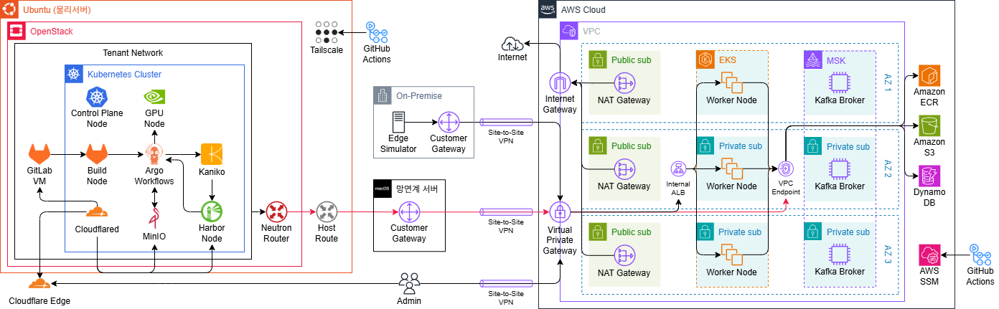

# Hybrid AI Serving Platform

하이브리드 클라우드 기반 비동기 AI 서빙 플랫폼 평가 제출용 문서입니다. 이 저장소는 AI 모델 학습부터 이미지 패키징, 하이브리드 전달, 서빙 배포까지 이어지는 **AI Serving Infrastructure**를 중심으로 구성되어 있습니다.

## 1. 프로젝트 개요

Hybrid AI Serving Platform은 **Private Cloud에서 AI 모델 학습/패키징을 수행하고, 검증된 모델 이미지를 Public Cloud의 AWS ECR/EKS/KServe 환경으로 전달하여 서빙하는 하이브리드 AI 서빙 인프라 프로젝트**입니다.

핵심 목적은 다음과 같습니다.

- 민감 데이터와 학습 환경은 Private Cloud에 유지
- Public Cloud에서는 확장 가능한 AI Serving 환경 제공
- 단순 모델 개발이 아니라 모델을 안정적으로 빌드, 전달, 배포, 운영하기 위한 인프라와 자동화 파이프라인 구축
- 민감 데이터 자체는 Public Cloud로 직접 이동하지 않고, **검증된 모델 이미지와 배포 매니페스트 중심으로 전달**

현재 저장소 기준으로는 다음 흐름이 확인됩니다.

- Private Cloud: OpenStack, Private Kubernetes, MinIO, Harbor, GitLab Runner, Argo Events/Workflows 관련 리소스
- Hybrid Bridge: Bastion, Site-to-Site VPN, ECR-over-VPN 전달 스크립트, Slack Alert Relay
- Public Cloud: AWS Terraform, ECR, EKS, ArgoCD, ArgoCD Image Updater, KServe, KEDA, MSK
- SRE: Prometheus, Grafana, Loki, Chaos Mesh, k6, Kafka Exporter

## 2. 아키텍처 다이어그램

본 프로젝트의 전체 하이브리드 아키텍처 원본은 Draw.io 파일로 관리합니다.

- 전체 아키텍처 원본: [`docs/architecture.drawio`](./docs/architecture.drawio)
- 전체 아키텍처 미리보기: `docs/architecture.drawio.png`



<!-- TODO: 필요 시 아래 세부 아키텍처 다이어그램 추가
- Private Cloud 모델 학습 파이프라인
- Hybrid Image Promotion Pipeline
- Public Cloud Event-Driven Serving Pipeline
- SRE Monitoring / Incident Flow
-->

## 3. 주요 개발 기능

| 구분 | 주요 기능 | 설명 | 관련 기술 |
|---|---|---|---|
| Edge | On-Premise Edge Simulator | 반도체 공장 환경을 모사하는 온프레미스 시뮬레이터로 설비 데이터를 생성하고 AWS 클라우드로 추론 요청을 전달한다. GitHub Actions로 시뮬레이터 이미지를 빌드하고 GHCR에 배포하며, 온프레미스 환경에서 실행되어 공장 설비 데이터 발생을 재현한다. | Docker, Python, GitHub Actions, GHCR, strongSwan, Ubuntu 24.04 LTS |
| Private | Private Cloud Infrastructure | 폐쇄망 환경에서 GPU 모델 학습과 AWS 추론용 이미지 생성 및 전달을 수행하는 내부 운영 인프라다. OpenStack 기반 VM 위에 Kubernetes 클러스터를 구성하고 GPU Node, Control Plane, NFS, MinIO, Argo Workflows, Harbor, GitLab Runner, Kaniko 기반 파이프라인을 운영한다. | OpenStack, Kubernetes, QEMU/KVM, Ubuntu 24.04 LTS, NVIDIA GPU, NFS, MinIO, Argo Workflows, Harbor, GitLab Runner, Kaniko, Trivy |
| Hybrid | Network Bridge / 망연계 서버 | Private Cloud는 공인 IP 없이 폐쇄망을 유지하고, 외부 통신은 망연계 서버를 통해 일원화한다. 데이터 플레인에서는 내부 네트워크 연결, IP Forwarding, IPsec 터널 종단을 담당하고, 관리 플레인에서는 VPN 자동 실행, 구성 파일 생성, 원격 접근 및 동기화를 담당한다. | Docker, GitHub Actions, strongSwan, Tailscale, SSH/rsync |
| Hybrid | Dependency Mirroring | 폐쇄망을 유지하면서 필요한 바이너리와 의존성 파일을 공급하기 위해 미러 저장소를 운영하고 SHA256 기반 무결성 검증을 수행한다. 번들 수집, 1차 검증, 미러 저장, 미러 제공, 패키지 다운로드, 2차 검증, 설치/실행 흐름으로 관리한다. | Mirroring, SHA256 Verification, Offline Bundle Management |
| Model | Model Training Pipeline | MinIO에 업로드된 학습 데이터와 `_SUCCESS` 오브젝트를 기준으로 Argo Workflows가 모델 학습을 수행하고, 결과물은 MinIO artifacts 경로에 저장한다. 이후 inference 코드, requirements, Dockerfile, 모델 파일을 조합해 predictor 이미지를 생성하고 Harbor에 push한다. | MinIO, Argo Workflows, GitLab Runner Pod, Kaniko, Harbor, Python, Dockerfile |
| Hybrid | Hybrid Image Promotion Pipeline | GitLab Runner가 Harbor에서 모델 이미지를 Pull하고 Trivy로 취약점을 검사한 뒤 Bastion 또는 Network Bridge Server를 경유해 AWS ECR로 Push한다. Harbor Pull, Bastion 경유 ECR Push, AWS ECR 적재 및 검증의 3단계로 구성된다. | GitLab Runner, Harbor, Trivy, skopeo, Bastion, NAT/SNAT/Routing, StrongSwan, Site-to-Site VPN, AWS ECR |
| Public | Public Cloud Serving Infrastructure | AWS 상에서 AI Serving 서비스를 운영하고 고객사 추론 요청을 안정적으로 처리하는 외부 서비스 인프라다. EKS Node Group, 3-AZ Multi-AZ 구조, On-Demand + Spot 조합, Cluster Autoscaler, KEDA, KServe 기반 확장 구조를 사용한다. | AWS, Amazon EKS, Amazon ECR, Amazon MSK, Docker, Terraform, GitHub Actions, KEDA, KServe, ArgoCD, Istio, Python, FastAPI |
| Public | Event-Driven Async Architecture | API, Kafka, Worker, PdM 모델을 직접 결합하지 않고 이벤트 기반으로 분리해 트래픽 급증 시 요청을 완충하고 장애를 격리한다. At-Least-Once 처리, Producer Idempotence, `request_id` 기반 제어, DynamoDB 조건부 쓰기, Exponential Backoff, Jitter 기반 재시도를 적용한다. | Kafka / Amazon MSK, KEDA, Worker Pod, DynamoDB, FastAPI |
| Public | High Availability / Scaling Architecture | On-Demand Node Group으로 기본 추론 용량을 확보하고 Spot Node Group으로 급증 트래픽을 비용 효율적으로 수용한다. Inference Worker는 Kafka Lag 기반으로, PdM Predictor는 동시 요청 수 기반으로 확장되며 PDB, Readiness Probe, Liveness Probe를 통해 가용성을 보강한다. 세부 min/max 및 threshold 값은 환경별 상이다. | Amazon EKS, KEDA, KServe, PodDisruptionBudget, Readiness Probe, Liveness Probe, Spot / On-Demand |
| Public | Istio Ambient Mesh Security | 내부 추론 경로에 공통 보안 계층을 적용하기 위해 Sidecar 대신 ztunnel / Waypoint 기반 Ambient Mesh를 도입했다. STRICT mTLS, AuthorizationPolicy, Kubernetes NetworkPolicy를 조합해 내부 접근을 제어한다. | Istio, Ambient Mesh, ztunnel, Waypoint, mTLS, Kubernetes NetworkPolicy |
| Service | Customer Dashboard | 고객사 운영 담당자가 설비별 추론 결과, 정상/고장 상태, 장비별 이상 이력을 확인할 수 있는 대시보드 기능이다. 실제 공개 URL은 README에 직접 쓰지 않으며 필요 시 `<DASHBOARD_URL>` placeholder를 사용한다. | FastAPI, React |
| SRE | Infrastructure / Service Monitoring | 플랫폼 운영 담당자가 클러스터 상태와 서비스 성능을 모니터링한다. Running Pods, Pod Restarts, Targets Up, Node/Pod 자원, Pending Pods, Autoscaling, KEDA/KServe Replica, E2E 지표, Error Rate, Availability, SLO, Error Budget, Kafka Lag, Retry, DLQ 등을 관찰한다. | Prometheus, Grafana, Loki |

본 프로젝트의 주요 개발 범위는 모델 자체의 성능 개선보다, 폐쇄망 기반 모델 학습·패키징 환경과 퍼블릭 클라우드 기반 실시간 추론 서빙 환경을 안정적으로 연결하는 인프라 파이프라인 구축에 초점을 둔다.

Private Cloud는 데이터 보안과 모델 생성/패키징을 담당하고, Public Cloud는 대규모 추론 요청 처리와 탄력적인 스케일링을 담당하도록 역할을 분리했다.

Kafka/KEDA 기반 Event-Driven 구조를 통해 API, Worker, Predictor를 분리하고, 트래픽 완충·장애 격리·독립 확장이 가능한 구조를 구현했다.

## 4. 사용 기술 스택 및 버전

| 분류 | 기술 | 버전/비고 | 역할 |
|---|---|---|---|
| Private Cloud | OpenStack | Terraform provider `~> 3.4`, 플랫폼 버전은 환경별 상이 | Private VM 및 네트워크 기반 인프라 |
| Container Platform | Kubernetes | Private 기본값 `v1.36` (`.env.example`), EKS 기본값 `1.31` (`public/terraform/variables.tf`) | 학습/서빙 워크로드 오케스트레이션 |
| SCM / CI | GitLab | GitLab CE `18.11.4-ce.0` (`private/ci/private-cloud-apply.sh`) | Private 소스 관리 및 CI 진입점 |
| Runner | GitLab Runner | Helm chart `0.89.1` (`private/gitlab-runner/README.md`) | Kubernetes executor 기반 파이프라인 실행 |
| Eventing | Argo Events | 문서 기준 | MinIO 이벤트 기반 트리거 |
| Workflow | Argo Workflows | 문서 기준 | 모델 학습, 패키징, 후속 전달 |
| Registry | Harbor | 환경별 상이 | Private 이미지 저장 및 검증 |
| Object Storage | MinIO | `RELEASE.2024-05-10T01-41-38Z` | 데이터셋/아티팩트 저장 |
| Image Build | Kaniko | `v1.23.2-debug` | 모델 서빙 이미지 빌드 |
| Security Scan | Trivy | 환경별 상이 | 이미지 보안 점검 |
| Public Registry | AWS ECR | 관리형 서비스 | Public 배포용 이미지 저장소 |
| Public Cluster | AWS EKS | 클러스터 버전 기본값 `1.31` | Public 서빙 클러스터 |
| Model Serving | KServe | Helm chart `v0.17.0`, ISVC API `serving.kserve.io/v1beta1` | 모델 추론 서빙 |
| GitOps | ArgoCD | Helm chart 변수 `7.8.23` | Public 배포 동기화 |
| Image Automation | ArgoCD Image Updater | 저장소 내 addon 구성, 버전은 환경별 상이 | ECR 태그 감지 및 GitOps 연계 |
| Network Bridge | StrongSwan | 환경별 상이 | Site-to-Site VPN 구성 |
| Hybrid Connectivity | Site-to-Site VPN | AWS VPN + Private 연동 | Private → Public 전송 경로 |
| Async Messaging | Kafka / AWS MSK | MSK Kafka `3.9.x` | 비동기 추론 요청 큐 |
| Event Scaling | KEDA | Helm chart `2.19.0` | Kafka lag 기반 오토스케일 |
| Monitoring | Prometheus | kube-prometheus-stack 사용, 버전은 환경별 상이 | 메트릭 수집 및 알림 |
| Visualization | Grafana | Helm chart 사용, 버전은 환경별 상이 | 대시보드 시각화 |
| Alert Relay | Slack Alert Relay | 저장소 내 FastAPI 기반 커스텀 이미지 | Private 이벤트를 Slack으로 중계 |

## 5. 디렉토리 구조

실제 저장소를 기준으로 핵심 구조만 정리하면 다음과 같습니다.

```bash
.
├── README.md
├── .env.example
├── .env.secret.example
├── .github/
│   └── workflows/
├── ha
├── private/
│   ├── aws-oidc/
│   ├── ci/
│   ├── gitlab-runner/
│   ├── gpu-worker/
│   ├── handoff/
│   ├── kubernetes/
│   │   └── model-build-workflows/
│   ├── kubernetes-bootstrap/
│   ├── openstack/
│   ├── openstack-kolla/
│   ├── openstack-local/
│   ├── reverse-proxy/
│   ├── storage/
│   └── templates/
├── public/
│   ├── k8s/
│   │   ├── apps/
│   │   ├── argocd/
│   │   ├── base/
│   │   ├── policy/
│   │   └── serving/
│   ├── terraform/
│   └── terraform-incluster/
├── services/
│   ├── dashboard-backend/
│   ├── dashboard-frontend/
│   ├── inference-api/
│   └── inference-worker/
├── infra-alert-images/
│   ├── alert-relay/
│   └── notify-runner/
├── sre/
│   └── k6/
├── sre-monitoring/
│   ├── chaos/
│   ├── chaos-mesh/
│   ├── grafana/
│   ├── k6/
│   ├── kafka-exporter/
│   ├── loki/
│   ├── prometheus/
│   └── scripts/
├── edge/
└── temp/
```

## 6. 실행 및 배포 방법

### 사전 준비

- Kubernetes cluster 접근 권한
- `kubectl`
- GitLab Runner 또는 GitHub Actions 실행 환경
- `aws` CLI
- AWS ECR Repository
- ArgoCD
- 필요한 Kubernetes Namespace (`model-build`, `argo-events`, `inference`, `argocd`, `monitoring` 등)
- VPN/Bastion 네트워크 연결

### GitHub Actions 실행 순서

1. `Public Terraform Deploy`: AWS Public Cloud 인프라를 먼저 생성
2. `Inference Image Build`: Public Cloud에서 실행될 추론 서비스 이미지를 빌드
3. `Setup Argo CD`: EKS에 ArgoCD 및 GitOps 배포 구성을 적용
4. `Private Cloud Controller`: Private Cloud와 Public Cloud 연계를 위한 Private 측 제어 작업을 수행

### 모델 빌드/학습 Workflow 실행

현재 저장소 기준 핵심 Workflow 경로:

- `private/kubernetes/model-build-workflows/workflowtemplates.yaml`
- `private/kubernetes/model-build-workflows/minio-event-sensor.yaml`
- `private/kubernetes/model-build-workflows/eventbus.yaml`
- `private/kubernetes/model-build-workflows/kustomization.yaml`

배포 예시:

```bash
kubectl apply -k private/kubernetes/model-build-workflows
```

수동 실행 예시:

```bash
argo submit -n model-build \
  --from workflowtemplate/model-build-job \
  -p image_tag=v1.0.0 \
  -p dataset_object_key=raw-data/dev/_SUCCESS
```

참고:

- 기본 파라미터 예시는 `workflowtemplates.yaml`에 정의되어 있습니다.
- `DATASET_OBJECT_KEY`는 `raw-data/<version>/_SUCCESS` 형식을 사용합니다.
- MinIO 이벤트 기반 자동 실행은 `argo-events` 리소스가 선행 배포되어야 합니다.

### GitLab CI/CD 실행

현재 저장소 상태 기준:

- GitLab Runner 구성: `private/gitlab-runner/`
- 모델 전달 설계 문서: `private/handoff/model-build-delivery.md`
- ECR-over-VPN 검증 스크립트: `private/ci/model-build-vpn-ecr-pipeline-mock.sh`
- 루트 `.gitlab-ci.yml`: 현재 저장소에 없음

따라서 평가 문서 기준 실행 흐름은 다음처럼 정리할 수 있습니다.

1. GitLab 프로젝트에 모델 코드와 `.gitlab-ci.yml`을 구성한다.  
2. `model-build` 태그를 가진 Runner가 Job을 수신한다.  
3. Runner가 Argo Workflow 실행 또는 Harbor → ECR 전달 단계를 호출한다.  

파라미터 예시:

```env
IMAGE_TAG=v1.0.0
DATASET_OBJECT_KEY=raw-data/dev/_SUCCESS
AWS_REGION=ap-northeast-2
ECR_REPOSITORY=predictive-model
```

현재 저장소에는 GitLab CI의 완성된 루트 파이프라인 대신, **Runner 구성과 handoff 문서, mock 스크립트가 준비된 상태**입니다.

실제 저장소에는 위 순서에 해당하는 GitHub Actions 워크플로가 포함되어 있습니다.

### ECR 이미지 확인

```bash
aws ecr describe-images \
  --repository-name predictive-model \
  --region ap-northeast-2
```

### ArgoCD 배포 확인

```bash
kubectl get application -n argocd
kubectl get isvc -n inference
kubectl get pods -n inference
```

### KServe 서비스 확인

현재 저장소 기준 InferenceService 이름은 `pdm`입니다.

```bash
kubectl get inferenceservice -n inference
kubectl get inferenceservice pdm -n inference
kubectl get pods -n inference
kubectl get svc -n inference
```

참고:

- `public/k8s/serving/predictive-model/pdm-isvc.yaml` 기준으로 Predictor 이미지가 연결됩니다.
- 실제 KServe가 생성한 Service 이름은 배포 환경별로 확인이 필요합니다.

## 7. 환경 변수 및 Secret 관리

본 프로젝트는 GitHub Actions Secrets, GitLab CI/CD Variables, Kubernetes Secret, Terraform tfvars를 분리하여 관리한다. README에는 변수명과 용도만 문서화하며, 실제 Secret 값은 저장소에 커밋하지 않는다.

### 7.1 AWS / Public Cloud 관련 Secrets

| 변수명 | 관리 위치 | 용도 | 비고 |
|---|---|---|---|
| `AWS_ECR_IAM_ID` | GitHub Actions Secrets | AWS ECR 이미지 Push 또는 AWS API 인증에 사용하는 IAM Access Key ID | 등록됨 / 워크플로 직접 사용 위치 확인 필요 |
| `AWS_ECR_IAM_PASS` | GitHub Actions Secrets | AWS ECR 이미지 Push 또는 AWS API 인증에 사용하는 IAM Secret Access Key | 등록됨 / 워크플로 직접 사용 위치 확인 필요 |
| `AWS_GITHUB_ACTIONS_ROLE_ARN` | GitHub Actions Secrets | GitHub Actions에서 OIDC 기반으로 AWS Role Assume 수행 | `.github/workflows/inference-image-build.yml`, `public-terraform-deploy.yml`, `setup-argocd.yml`, `vpn-connect.yml` 등에서 사용 |
| `PUBLIC_TERRAFORM_TFVARS` | GitHub Actions Secrets | Public Cloud Terraform 변수 파일 내용 | EKS, VPC, MSK 등 Public Infra 구성. `public-terraform-deploy.yml`에서 repository variable fallback과 함께 사용 |
| `CLOUDFLARE_API_TOKEN` | GitHub Actions Secrets | Cloudflare DNS 및 도메인 자동화 | `private-cloud-remote.yml`에서 Private Cloud DNS/프록시 자동화에 전달 |

설명:

- `PUBLIC_TERRAFORM_TFVARS` 내부 변수명은 README에 노출하지 않으며, workflow 실행 시 tfvars 파일로 복원해 사용한다.
- AWS 인증은 가능하면 장기 Access Key보다 OIDC 기반 `AWS_GITHUB_ACTIONS_ROLE_ARN` 사용을 우선한다.

### 7.2 Private Cloud / OpenStack 관련 Secrets

| 변수명 | 관리 위치 | 용도 | 비고 |
|---|---|---|---|
| `OPENSTACK_PASSWORD` | GitHub Actions Secrets | OpenStack API 인증 비밀번호 | `private-cloud-remote.yml`에서 `OS_PASSWORD`로 사용 |
| `PRIVATE_CLOUD_TFVARS` | GitHub Actions Secrets | Private Cloud Terraform 변수 파일 내용 | OpenStack 리소스 구성. workflow에서 파일로 복원해 사용 |
| `PRIVATE_CLOUD_HOST_SSH_PRIVATE_KEY` | GitHub Actions Secrets | Private Cloud Host 접근용 SSH Private Key | `private-cloud-remote.yml`, `vpn-connect.yml`에서 원격 배포/동기화에 사용 |
| `PRIVATE_CLOUD_SSH_PRIVATE_KEY` | GitHub Actions Secrets | Private Cloud VM 또는 노드 접근용 SSH Private Key | `private-cloud-remote.yml`에서 원격 환경 변수로 전달 |
| `PRIVATE_CLOUD_SSH_PUBLIC_KEY` | GitHub Actions Secrets | Private Cloud VM 또는 노드에 등록할 SSH Public Key | `private-cloud-remote.yml`에서 원격 환경 변수로 전달 |
| `TAILSCALE_AUTHKEY` | GitHub Actions Secrets | Tailscale 기반 원격 접근 및 사설망 연결 자동화 | `private-cloud-remote.yml`에서 OAuth 대체 경로로 사용 |

설명:

- SSH Key 본문은 README에 작성하지 않는다.
- `PRIVATE_CLOUD_TFVARS`는 Secret으로 저장하고 workflow에서 파일로 복원해 사용한다.

### 7.3 Hybrid Bridge / GitLab / Harbor / MinIO 관련 Secrets

| 변수명 | 관리 위치 | 용도 | 비고 |
|---|---|---|---|
| `GITLAB_PIPELINE_TRIGGER_TOKEN` | GitHub Actions Secrets | GitLab Pipeline Trigger 호출에 사용 | `private-cloud-remote.yml`에서 Private 모델 빌드/전달 파이프라인 연계용으로 전달 |
| `GITLAB_ROOT_PASSWORD` | GitHub Actions Secrets | Self-managed GitLab 초기 관리자 비밀번호 또는 자동화 설정 | `private-cloud-remote.yml`에서 GitLab bootstrap 단계에 전달 |
| `PAT_FOR_GITLAB` | GitHub Actions Secrets | GitLab API 접근 또는 연동 자동화용 Personal Access Token | 등록됨 / 사용 위치 확인 필요 |
| `HARBOR_ADMIN_PASSWORD` | GitHub Actions Secrets | Harbor 관리자 계정 인증에 사용 | `private-cloud-remote.yml`에서 Harbor bootstrap에 전달 |
| `HARBOR_CA_CERT` | GitHub Actions Secrets | Harbor 사설 인증서 신뢰 구성을 위한 CA 인증서 | `private-cloud-remote.yml`에서 인증서 파일 복원용으로 전달 |
| `MINIO_ROOT_PASSWORD` | GitHub Actions Secrets | MinIO 관리자 계정 인증에 사용 | `private-cloud-remote.yml`에서 MinIO bootstrap에 전달 |
| `BASTION_DISPATCH_TOKEN` | GitHub Actions Secrets | Bastion 또는 망연계 서버로 작업 요청 dispatch 시 사용 | `public-terraform-deploy.yml`, `vpn-connect.yml`에서 사용 |

설명:

- GitLab Root Password는 초기화 및 제한적 운영 자동화 용도로만 사용한다.
- `HARBOR_CA_CERT`는 인증서 본문을 노출하지 않고 Secret에서 파일로 복원해 사용한다.
- `BASTION_DISPATCH_TOKEN` 값은 README에 절대 기재하지 않는다.

### 7.4 GitHub App / GitOps 자동화 관련 Secrets

| 변수명 | 관리 위치 | 용도 | 비고 |
|---|---|---|---|
| `GH_APP_ID` | GitHub Actions Secrets | GitHub App 인증에 사용하는 App ID | `setup-argocd.yml`에서 사용 |
| `GH_APP_INSTALLATION_ID` | GitHub Actions Secrets | GitHub App 설치 ID | `setup-argocd.yml`에서 사용 |
| `GH_APP_PRIVATE_KEY` | GitHub Actions Secrets | GitHub App 인증용 Private Key | `setup-argocd.yml`에서 사용 |

설명:

- GitHub App 기반 인증은 PAT보다 권한 범위를 제한하기 쉽다.
- 현재 저장소에서는 ArgoCD bootstrap 및 GitOps 자동화 연계에 사용된다.

### 7.5 Alert / Monitoring 관련 Secrets

| 변수명 | 관리 위치 | 용도 | 비고 |
|---|---|---|---|
| `INFRA_ALERTS` | GitHub Actions Secrets | 인프라 장애 또는 배포 실패 알림 대상 | `public-terraform-deploy.yml`에서 `DLQ_SLACK_WEBHOOK_URL`로 사용 |
| `ML_ALERTS` | GitHub Actions Secrets | 모델 빌드/학습/추론 관련 알림 대상 | 등록됨 / 사용 위치 확인 필요 |
| `SLO_ALERTS` | GitHub Actions Secrets | SLO, Error Budget, 서비스 품질 관련 알림 대상 | 등록됨 / 사용 위치 확인 필요 |

설명:

- 실제 Slack Webhook URL, 채널 ID, 토큰은 README에 쓰지 않는다.
- README에는 알림 대상 또는 Webhook 식별 정보 수준으로만 문서화한다.

### 7.6 Terraform Backend 관련 Secrets

| 변수명 | 관리 위치 | 용도 | 비고 |
|---|---|---|---|
| `TF_BACKEND_CONFIG` | GitHub Actions Secrets | Terraform remote backend 설정 파일 내용 | `private-cloud-remote.yml`에서 사용 |

설명:

- Terraform state는 로컬이 아닌 remote backend 사용을 전제로 한다.
- Backend 설정 내용은 Secret으로 관리하며 workflow 실행 시 파일로 복원한다.
- 실제 bucket, key, endpoint, access key 등은 README에 노출하지 않는다.

### 7.7 문서용 Placeholder 예시

아래 예시는 실제 사용 파일이 아니라 문서용 placeholder 예시다. GitHub Actions Secrets에 등록된 값은 `.env` 파일로 커밋하지 않는다.

```env
# AWS / Public Cloud
AWS_REGION=ap-northeast-2
AWS_ECR_IAM_ID=<AWS_ECR_IAM_ID>
AWS_ECR_IAM_PASS=<AWS_ECR_IAM_PASS>
AWS_GITHUB_ACTIONS_ROLE_ARN=<AWS_GITHUB_ACTIONS_ROLE_ARN>
PUBLIC_TERRAFORM_TFVARS=<PUBLIC_TERRAFORM_TFVARS>

# Private Cloud
OPENSTACK_PASSWORD=<OPENSTACK_PASSWORD>
PRIVATE_CLOUD_TFVARS=<PRIVATE_CLOUD_TFVARS>
PRIVATE_CLOUD_HOST_SSH_PRIVATE_KEY=<PRIVATE_CLOUD_HOST_SSH_PRIVATE_KEY>
PRIVATE_CLOUD_SSH_PRIVATE_KEY=<PRIVATE_CLOUD_SSH_PRIVATE_KEY>
PRIVATE_CLOUD_SSH_PUBLIC_KEY=<PRIVATE_CLOUD_SSH_PUBLIC_KEY>
TAILSCALE_AUTHKEY=<TAILSCALE_AUTHKEY>

# Hybrid Bridge / GitLab / Harbor / MinIO
GITLAB_PIPELINE_TRIGGER_TOKEN=<GITLAB_PIPELINE_TRIGGER_TOKEN>
GITLAB_ROOT_PASSWORD=<GITLAB_ROOT_PASSWORD>
PAT_FOR_GITLAB=<PAT_FOR_GITLAB>
HARBOR_ADMIN_PASSWORD=<HARBOR_ADMIN_PASSWORD>
HARBOR_CA_CERT=<HARBOR_CA_CERT>
MINIO_ROOT_PASSWORD=<MINIO_ROOT_PASSWORD>
BASTION_DISPATCH_TOKEN=<BASTION_DISPATCH_TOKEN>

# GitHub App
GH_APP_ID=<GH_APP_ID>
GH_APP_INSTALLATION_ID=<GH_APP_INSTALLATION_ID>
GH_APP_PRIVATE_KEY=<GH_APP_PRIVATE_KEY>

# Alert
INFRA_ALERTS=<INFRA_ALERTS>
ML_ALERTS=<ML_ALERTS>
SLO_ALERTS=<SLO_ALERTS>

# Terraform Backend
TF_BACKEND_CONFIG=<TF_BACKEND_CONFIG>

# DNS
CLOUDFLARE_API_TOKEN=<CLOUDFLARE_API_TOKEN>
```

## 8. GitHub 저장소 관리 및 평가자 접근 안내

이 저장소는 코드, Kubernetes Manifest, 인프라 설정, 운영 스크립트, 배포 문서를 **GitHub 저장소에서 통합 관리**하는 구조입니다.

평가자 접근 안내:

- Private Repository라면 평가자 GitHub 계정에 **Read 권한**을 부여해야 합니다.
- README 기준으로 저장소를 탐색하면 Private, Public, Hybrid, SRE 구성을 한 번에 확인할 수 있습니다.
- 현재 저장소는 GitHub Actions 기반 자동화 파일이 포함되어 있으며, GitLab CI는 Runner/문서 중심으로 준비되어 있습니다.

평가자가 우선 확인할 핵심 경로:

| 경로 | 확인 포인트 |
|---|---|
| `README.md` | 프로젝트 전체 개요 및 제출 문서 |
| `.github/workflows/` | Public Terraform, ArgoCD, 이미지 빌드 자동화 |
| `private/ci/` | Private 적용 및 ECR-over-VPN 전달 스크립트 |
| `private/gitlab-runner/` | GitLab Runner 구성 |
| `private/kubernetes/model-build-workflows/` | MinIO 이벤트, Argo Workflow 템플릿 |
| `private/storage/` | MinIO 및 스토리지 기준 |
| `private/handoff/` | Hybrid 전달 및 운영 인계 문서 |
| `public/terraform/` | AWS ECR/EKS/MSK/VPN 인프라 코드 |
| `public/k8s/argocd/` | ArgoCD GitOps 애플리케이션 |
| `public/k8s/serving/predictive-model/` | KServe InferenceService 매니페스트 |
| `services/` | inference-api, inference-worker, dashboard 서비스 코드 |
| `infra-alert-images/` | Slack Alert Relay 이미지 구성 |
| `sre-monitoring/` | Prometheus, Grafana, Loki, Chaos, Kafka Exporter |

참고:

- `docs/` 및 `docs/images/`는 현재 저장소 루트에 존재하지 않습니다.
- 루트 `.gitlab-ci.yml`도 현재 저장소에는 없습니다.

## 9. 시연 영상 안내

- 시연 영상은 YouTube 비공개 링크 또는 클라우드 저장소 링크로 제공합니다.
- 영상은 프로젝트 핵심 기능 중심으로 구성합니다.
- 아직 링크가 없다면 placeholder로 둡니다.

- 시연 영상 링크: `<YouTube 비공개 링크 또는 클라우드 저장소 링크 입력>`

### 시연 구성

1. MinIO 데이터 업로드 및 이벤트 발생
2. Argo Events / Workflow 기반 모델 빌드
3. GitLab CI/CD 파이프라인 실행
4. Harbor 또는 ECR 이미지 저장 확인
5. Bastion / VPN 경유 ECR Push 확인
6. ArgoCD Image Updater 기반 GitOps 반영
7. KServe Predictor Pod 배포 및 이미지 교체 확인
8. 장애 발생 시 Slack Alert Relay 알림 확인

## 10. 팀 역할

| 이름 | 역할 | 담당 영역 | 주요 기술 |
|---|---|---|---|
| 김세원 | 팀장 · Public | AWS Public Cloud 및 비동기 처리 영역 | AWS, EKS, Kafka |
| 문경호 | 팀원 · Private | Private Cloud 및 내부 인프라 영역 | OpenStack, Bastion |
| 신민석 | 팀원 · SRE | 관측성, 장애 검증, 신뢰성 확보 | Monitoring, Chaos |
| 안예원 | 팀원 · Model | 모델 빌드 및 패키징 영역 | Model Build, Package |
| 정승민 | 팀원 · Hybrid | 하이브리드 전달 및 배포 자동화 영역 | GitLab, ArgoCD |


## 11. 트러블슈팅 및 운영 포인트

| 구분 | 문제 상황 | 원인 | 해결 과정 | 결과 / 회고 |
|---|---|---|---|---|
| Private Cloud | 재배포 중 GPU Worker VM이 반복적으로 실패했고, VM 재시작만으로는 복구되지 않았다. 게스트 OS 내부 문제만으로 보기 어려운 장애였다. | GPU Passthrough 환경에서 GPU가 PCI 버스에서 이탈하는 Xid 154 "Fallen off the bus" 장애가 발생했다. 호스트 PCI 계층, 디바이스/브리지 토폴로지, FLR 가능 여부, vfio 바인딩 상태까지 함께 확인해야 하는 문제였다. | 호스트 PCI 계층에 진입해 디바이스 및 브리지 토폴로지를 확인하고 FLR과 링크 복구를 점검했다. 상위 브리지 기준 SBR까지 시도한 뒤 동일 패턴이 재현되는 것을 확인했고, 소비자 GPU reset 한계로 판단해 콜드 리부트를 수행했다. 이후 vfio 재바인딩과 VM 자동 기동 절차를 systemd로 자동화했다. | 재부팅 이후에도 vfio 바인딩과 VM 기동이 자동화되어 재발 시 수동 개입을 줄일 수 있게 됐다. 또한 가상화 환경 장애를 호스트 계층과 게스트 계층으로 분리해 진단하는 운영 경험을 확보했다. |
| Public Cloud | Istio Ambient Mesh 적용 후 `inference-worker -> pdm-predictor` HTTP 호출이 실패했고, `Connection reset by peer`가 발생했다. Pod, ALB, Kafka 등 주요 리소스는 정상이었지만 내부 Pod 간 통신 단절로 추론 결과 적재 실패와 DLQ 발생으로 이어졌다. | Ambient 환경에서 AuthorizationPolicy를 ServiceAccount principals 단위로 좁혀 제한한 기존 정책이 실제 dataplane인 ztunnel/HBONE 경로와 정상적으로 매칭되지 않아 모든 트래픽이 차단됐다. | Ambient 순정 상태를 기준점으로 두고 보안 정책을 bottom-up 방식으로 순차 검증했다. Ambient Dataplane 단독과 STRICT mTLS는 정상, ServiceAccount 기반 AuthorizationPolicy 추가 시 실패를 확인했고, 이후 허용 범위를 ServiceAccount 단위에서 Namespace 단위로 조정해 `namespaces: [inference]` 기준으로 변경했다. NetworkPolicy는 유지한 상태로 검증을 마무리했다. | Ambient + STRICT mTLS + NetworkPolicy 보안 구성은 유지하면서 Worker와 Predictor 간 통신을 복구했고, AI 추론 파이프라인을 정상화했다. 또한 보안 정책은 단순 완화가 아니라 Ambient dataplane 경로와 맞는 단위로 조정해야 한다는 운영 기준을 확보했다. |

## 12. 평가자 확인 체크리스트

- [ ] GitHub 저장소 접근 권한 확인
- [ ] README.md 프로젝트 개요 확인
- [ ] `docs/architecture.drawio` 참조 경로 확인
- [ ] 기술 스택 및 버전 확인
- [ ] 디렉토리 구조 확인
- [ ] 실행 및 배포 방법 확인
- [ ] 환경 변수 설정 방법 확인
- [ ] 시연 영상 링크 확인
- [ ] 주요 Manifest / Workflow / Terraform 경로 확인
- [ ] GitLab Runner / Argo Workflow / ECR-over-VPN / ArgoCD / KServe 흐름 확인

## 부록: 제출 문서 작성 메모

- 전체 아키텍처 원본 참조는 `docs/architecture.drawio` 기준으로 정리했습니다.
- README 미리보기용 PNG/SVG export 파일은 아직 없어 TODO로 남겼습니다.
- 현재 저장소에는 루트 `.gitlab-ci.yml`이 없어 GitLab CI/CD는 Runner 및 handoff 문서 기준으로 설명했습니다.
- 실제 저장소에 존재하지 않는 경로는 확정적으로 쓰지 않았으며, 확인이 어려운 항목은 `환경별 상이` 또는 `문서 기준`으로 표기했습니다.
